## Context & Inspiration

These thoughts are inspired by the IBM Technology video: 
👉 **[AI Gave You A Promotion: Why AI Isn't Replacing Jobs](https://www.youtube.com/watch?v=1ItQnh3LWeg)**.

The video outlines a major shift in how organizations are structured, moving from the classic **Pyramid** to the **Diamond** model as AI automates routine entry-level tasks.

---

## The Structural Transition: Pyramid to Diamond

### 1. The Traditional Pyramid (The "Do" Economy)
Historically, organizations have operated as a pyramid. The vast majority of the workforce sits at the bottom, performing routine execution tasks ("doing"). As you move up, the volume of workers decreases while responsibility increases:

- **C (Chiefs)** — Lead Leaders
- **EXEC (Executives)** — Steer Strategy
- **MGR (Managers)** — Lead People
- **SR (Seniors)** — Own Operations
- **EXP (Experienced)** — Supervise Execution
- **ENTRY (Entry Level)** — Do the Work

### 2. The AI Diamond (The "Curate" Economy)
With the integration of AI agents and large language models, the bottom layer is rapidly squeezed. AI is highly effective at doing the entry-level "DO" tasks. Because AI handles the routine execution, the middle tier (Seniors and Managers) expands outward, turning the pyramid into a diamond:

```text
    TRADITIONAL PYRAMID                    THE AI DIAMOND
           
            /\                                   /\
           /  \                                 /  \
          / C  \                               / C  \
         /------\                             /------\
        /  EXEC  \                           /  EXEC  \
       /----------\                         /----------\
      /    MGR     \                       /    MGR     \
     /--------------\                     /   & SENIOR   \
    /      EXP       \                   /                \
   /------------------\                 \      EXP       /
  /      ENTRY         \                 \    ENTRY     /
 /______________________\                 \____________/
                                          [AI]      [AI]
```

Under this model, **everyone is effectively promoted**. Instead of entering an organization to "do" basic tasks, you enter to "curate," "orchestrate," and "audit" the AI agents that are doing the work.

---

## Visualizing the Labor Flow

Here is a visual mapping of the transition:

```mermaid
graph TD
    subgraph The Traditional Pyramid
        P_C["[C] Chiefs (Lead Leaders)"] --> P_EXEC["[EXEC] Executives"]
        P_EXEC --> P_MGR["[MGR] Managers (Lead People)"]
        P_MGR --> P_SR["[SR] Seniors (Own)"]
        P_SR --> P_EXP["[EXP] Experienced (Review)"]
        P_EXP --> P_ENTRY["[ENTRY] Entry Level (Do)"]
    end

    subgraph The AI Diamond Shift
        D_C["[C] Chiefs (Lead Leaders)"] --> D_EXEC["[EXEC] Executives"]
        D_EXEC --> D_MGR["[MGR & SR] Bulging Middle Class (Curate & Guide AI)"]
        D_MGR --> D_EXP["[EXP] Compressed Tier"]
        D_EXP --> D_ENTRY["[ENTRY] Minimized Bottom (AI handles routine DO tasks)"]
        
        AI_Left["[AI Automation]"] -.->|Squeezes Bottom| D_ENTRY
        AI_Right["[AI Amplification]"] -.->|Expands Middle| D_MGR
    end

    classDef shift fill:#1d1b1a,stroke:#524f48,color:#e8e4d9;
    classDef highlight fill:#10b981,stroke:#34d399,color:#fff;
    class D_MGR highlight;
```



---

## Reflections & Systems Impact

### 1. The "Internship Crunch" & The Computer Science Dilemma
The shrinkage of the entry-level tier poses a significant challenge. Today, a massive volume of computer science graduates enter the market expecting traditional entry-level coding roles. However, because AI coding assistants and agents automate basic script-writing and boilerplate generation, the volume of traditional "entry" roles has decreased.

To survive in this market, new graduates must bypass the traditional "doing" stage and immediately develop senior-level capabilities: **systems design, security auditing, code review, and prompt orchestration**.

### 2. The Bhagavad Gita Analogy: Cycles of Creation and Dissolution
This shift mirrors the cyclic nature described in the Bhagavad Gita—where every end (pralaya) is simultaneously a new beginning (srishti). The dismantling of the traditional entry-level programmer role is not the end of software engineering; it is the birth of the systems orchestrator. The death of the "coder" is the genesis of the "creator." 

### 3. The Security & Observability Mandate
In a diamond-shaped organization where the middle layer leverages dozens of AI agents to multiply output, observing and securing these agents becomes critical. This directly connects to our work on **AI Token Provenance**. If Seniors and Managers are orchestrating networks of autonomous agents, we must have complete runtime observability to ensure those agents are:
- Performing tasks securely without leaking credentials
- Attributing computational token consumption to prevent resource hijacking
- Not introducing supply chain risks through malicious, unverified code generators

As IBM Technology notes, AI doesn't replace jobs—it upgrades them. The challenge is ensuring the infrastructure we build to support these upgraded roles remains secure, transparent, and resilient.
